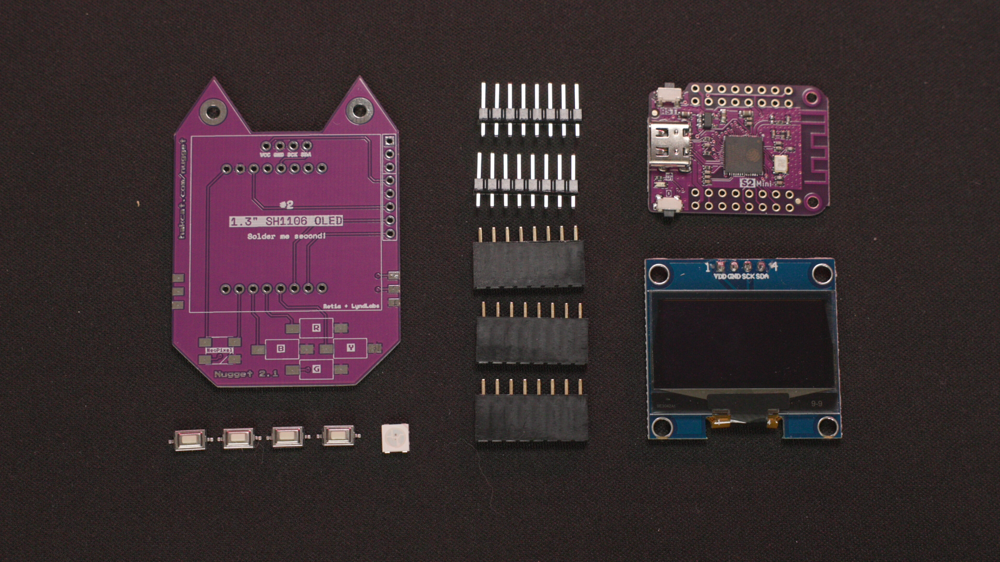

# WiFi Nugget Developer Kit v2.2
This repository contains KiCAD design files for the WiFi Nugget Developer Kit PCB.  The current version of this release is `2.2`.
This kit is designed to teach beginners basic hardware assembly skills, and features both through-hole and surface mount components.

   
  
   
  <b>ESP32-S2 DevKit Components</b>
   
   

## Features
This kit is designed to work with the [Wemos "mini" form factor](https://www.wemos.cc/en/latest/), and accomodates breakouts for the ESP8266, ESP32-S2, and some other Espressif based board designs.
The developer kit includes:

- **Buttons** (D-Pad style, 4 Buttons)
- **RGB LED** (WS2812B NeoPixel)
- **WiFi Microcontroller** ([D1](https://www.wemos.cc/en/latest/d1/index.html)/[S2](https://www.wemos.cc/en/latest/s2/index.html)/[C3](https://www.wemos.cc/en/latest/c3/index.html) Mini)
- **Screen** (SH1106 1.3" OLED)
- **Expansion Headers** 
- **Screw Assembly*** (M2.5 Screws / Threaded Inserts)
- **3D Printed Case***

\* *We ditched the screw assembly on newer Nuggets, which use a snap-fit case.  You can find links to our case designs below.*

## Resources
- [Assembly Guide]()
- [3D printed cases](https://github.com/HakCat-Tech/WiFi-Nugget-Cases)
